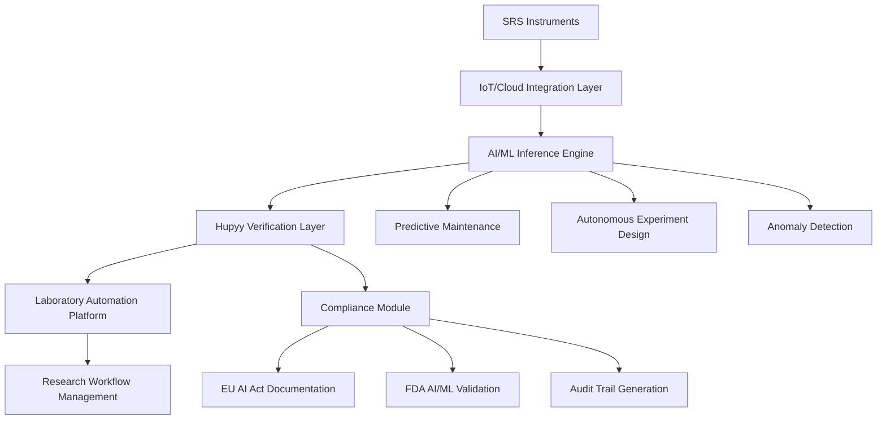

# Sprint 03: Regulatory-Compliant Smart Lab Integration

**Project**: Stanford Research Systems Strategic Opportunities
**Company**: Hupyy
**Client**: Stanford Research Systems
**Industry**: Scientific Test & Measurement Equipment
**Date**: 2025-01-16
**Priority**: Medium-High
**Estimated Duration**: 4-5 weeks

## Overview

Enable Stanford Research Systems to offer "AI-Verified Smart Instruments" that integrate seamlessly into automated laboratory workflows while meeting emerging regulatory requirements (EU AI Act, FDA AI/ML guidelines). This positions SRS to compete in the rapidly growing lab automation market ($6.36B in 2025 → $14.78B by 2034) by adding AI/ML capabilities with built-in hallucination prevention and regulatory compliance.

## Business Value

### For Stanford Research Systems
- **Market Positioning**: Transition from "precision instruments" to "AI-verified smart laboratory systems"
- **Regulatory Compliance**: Built-in EU AI Act explainability and FDA AI/ML validation requirements
- **Competitive Catch-Up**: Competitors (Keysight, Tektronix, Agilent) are ahead in lab automation and AI integration
- **Ecosystem Play**: Become central hub in automated laboratory workflows (IoT, cloud, AI/ML)

### Market Opportunity
- **TAM**: Global lab automation market: $6.36B (2025) → $14.78B (2034) at 9.7% CAGR
- **SAM**: AI-enabled scientific instrument systems: ~$1.27B (20% of current TAM, rapidly growing)
- **SOM**: Regulatory-compliant AI-verified instruments: ~$190M (15% of SAM, emerging premium category)

### Revenue Potential
- **Smart Instrument Premium**: +30-50% price premium over standard instruments ($5K-20K per unit)
- **AI Platform Subscription**: $1K-5K/month per laboratory for AI verification platform
- **Integration Services**: $100K-1M per laboratory for smart lab deployment
- **Estimated Year 1 Revenue**: $8.2M (assuming 200 smart instruments + 40 platform subscriptions + 5 enterprise integrations)

## Technical Feasibility

### Strong Alignment with Market Trends
1. **Lab Automation Growth**: 7.2-9.7% CAGR (2024-2034) driven by AI/ML adoption
2. **Self-Driving Labs**: Emerging trend in chemical/materials sciences requiring verified autonomous decision-making
3. **IoT Integration**: SRS instruments need smart sensors, remote monitoring, predictive maintenance
4. **Regulatory Pressure**: EU AI Act (2024) and FDA AI/ML guidelines (2024) create compliance demand

### Technical Architecture


### Integration Points
- **Instrument Firmware**: Add AI inference capabilities to SRS instruments
- **Cloud Platform**: Centralized AI/ML model management and verification
- **Laboratory Information Management Systems (LIMS)**: Integration with existing lab software
- **Robotic Automation**: Interface with liquid handlers, sample changers, robotic systems

## Implementation Feasibility

### Medium-High Barriers to Entry
- **Ecosystem Complexity**: Requires integration with multiple third-party systems (LIMS, ELN, robotic automation)
- **AI/ML Expertise**: SRS currently lacks AI/ML capabilities (no evidence in research)
- **Regulatory Uncertainty**: EU AI Act and FDA guidelines are new, interpretation still evolving
- **Standards Development**: Lab automation standards (SiLA2, AnIML) still maturing

### Resource Requirements
- **Hupyy Engineering**: 4 engineers × 6 months for platform development
- **SRS Engineering**: 3 engineers × 6 months for instrument integration + 1 AI/ML expert (new hire)
- **Regulatory Consulting**: $100K for EU AI Act and FDA compliance strategy
- **Partnership Development**: Collaborations with LIMS vendors, robotic automation companies
- **Total Cost**: ~$500K for pilot phase
- **Time to Market**: 9-12 months to commercial beta

### Risk Mitigation
- **Technical Risk**: MEDIUM-HIGH - Complex ecosystem, multiple integration points
- **Regulatory Risk**: MEDIUM - EU AI Act interpretation, FDA acceptance of verification approach
- **Market Risk**: MEDIUM - Lab automation adoption varies by industry (pharma fast, academia slow)
- **Competitive Risk**: HIGH - Keysight, Agilent, Thermo Fisher already have lab automation platforms
- **Partnership Risk**: MEDIUM - Dependent on LIMS/robotic automation vendor cooperation

## Objectives

1. Conduct comprehensive research across 6 key dimensions
2. Generate minimum 25 research files
3. Apply scoring rubric to evaluate opportunity
4. Provide go/no-go recommendation with justification

## Task Breakdown

### Task 01: Technical & Regulatory Landscape
**Skill**: technical-researcher
**Parallel Subtasks**: 6
**Focus**:
- Lab automation standards (SiLA2, AnIML, ISA-88 batch control, ASTM E2527)
- EU AI Act requirements for high-risk AI systems (Annex III scientific instruments classification)
- FDA AI/ML guidance for medical device software and laboratory testing
- IoT protocols for scientific instruments (MQTT, OPC UA, REST APIs)
- Self-driving laboratory architectures and AI-guided experimentation
- Interoperability with LIMS, ELN, and laboratory automation platforms

### Task 02: Market & Competitive Assessment
**Skill**: market-analyst
**Parallel Subtasks**: 5
**Focus**:
- TAM/SAM/SOM for lab automation and AI-enabled scientific instruments
- Competitive landscape (Keysight PathWave, Agilent OpenLab, Thermo Fisher Connect, PerkinElmer Signals)
- Customer segments (pharma R&D, biotech, materials science, academic research)
- Pricing models (smart instrument premium, SaaS platform, integration services)
- Market trends: self-driving labs, digital twins, AI-guided research, regulatory compliance automation

### Task 03: Solution Architecture Design
**Skill**: solution-architect
**Parallel Subtasks**: 6
**Focus**:
- Smart instrument architecture (edge AI inference + cloud orchestration)
- Hupyy verification integration for autonomous decision-making
- LIMS/ELN/robotic automation integration architecture
- Compliance module design (EU AI Act documentation, FDA validation, audit trails)
- Predictive maintenance and anomaly detection algorithms
- Scalability for multi-vendor laboratory ecosystems

### Task 04: Certification & Testing Strategy
**Skill**: compliance-analyst
**Parallel Subtasks**: 5
**Focus**:
- EU AI Act conformity assessment pathway for high-risk AI systems
- FDA 510(k) premarket notification for AI/ML-enabled laboratory devices (if applicable)
- ISO 15189 medical laboratory accreditation with AI/ML components
- Validation testing for self-driving laboratory applications
- Beta testing program with pharma/biotech early adopters

### Task 05: Implementation Roadmap
**Skill**: roadmap-planner
**Parallel Subtasks**: 6
**Focus**:
- Phase 1: Smart instrument pilot with RGA (residual gas analyzer) for semiconductor fab automation (9 months)
- Phase 2: LIMS integration and EU AI Act compliance module (6 months)
- Phase 3: Self-driving lab expansion (materials science, chemistry) (9 months)
- Resource requirements: AI/ML expertise, regulatory consultants, partnership development
- Partnership strategy: LIMS vendors (LabWare, Thermo Fisher), robotic automation (Tecan, Hamilton)
- Risk mitigation: modular architecture, phased regulatory approvals, pilot-driven validation

### Task 06: Final Report Synthesis
**Skill**: report-synthesizer
**Dependencies**: Tasks 01-05
**Focus**: Comprehensive report, scoring, go/no-go recommendation

## Success Criteria

- [ ] All 6 tasks completed
- [ ] Minimum file count met (25 files)
- [ ] Citation coverage ≥ 80% (evidence-based claims)
- [ ] All cross-references validated
- [ ] Final report generated
- [ ] Opportunity scored (0-100)
- [ ] Go/no-go recommendation provided

## Directory Structure

```
temp/sprint-03/
├── 01-technical/           # Technical & regulatory research
├── 02-market/              # Market & competitive analysis
├── 03-architecture/        # Solution architecture design
├── 04-certification/       # Certification & testing strategy
├── 05-roadmap/             # Implementation roadmap
└── 06-synthesis/           # Final report synthesis
```

## Output Deliverables

- **Research Files**: temp/sprint-03/ (all tasks)
- **Final Report**: reports/sprint-03-final-report.md
- **Executive Summary**: reports/sprint-03-executive-summary.md
- **Scoring Breakdown**: reports/sprint-03-scoring.md
- **Recommendation**: reports/sprint-03-recommendation.md

## Strategic Rationale

This opportunity represents **strategic market positioning** with long-term growth potential:

1. **Market Transformation**: Lab automation is the fastest-growing segment (9.7% CAGR)
2. **Regulatory Tailwind**: EU AI Act and FDA AI/ML guidelines create compliance demand
3. **Competitive Necessity**: SRS risks obsolescence without AI/ML capabilities
4. **Platform Play**: Positions SRS as ecosystem orchestrator, not just instrument vendor
5. **Premium Pricing**: Smart instruments command 30-50% price premium
6. **Recurring Revenue**: SaaS platform creates predictable revenue stream
7. **Future-Proofing**: Self-driving labs are inevitable - early positioning is critical

## Challenges to Address

1. **High Complexity**: Multi-vendor ecosystem integration is technically challenging
2. **Resource Intensive**: Requires significant investment in AI/ML capabilities and partnerships
3. **Competitive Pressure**: SRS is behind competitors in lab automation - catch-up execution risk
4. **Regulatory Uncertainty**: EU AI Act and FDA guidelines are new, compliance pathway unclear
5. **Long Sales Cycle**: Laboratory automation projects take 12-24 months from pilot to deployment
6. **Cultural Change**: SRS must transition from hardware-focused to software/platform company

## Why This Matters Despite Challenges

- **Existential Threat**: Competitors with AI-enabled platforms will commoditize SRS's precision instruments
- **Regulatory Forcing Function**: EU AI Act makes verified AI systems mandatory in Europe (SRS's second-largest market)
- **Hupyy's Unique Value**: Only formal verification can provide the regulatory compliance and hallucination prevention required for autonomous labs
- **Strategic Partnership**: SRS needs Hupyy more than Hupyy needs SRS - strong negotiating position for favorable terms
